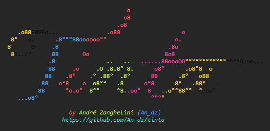
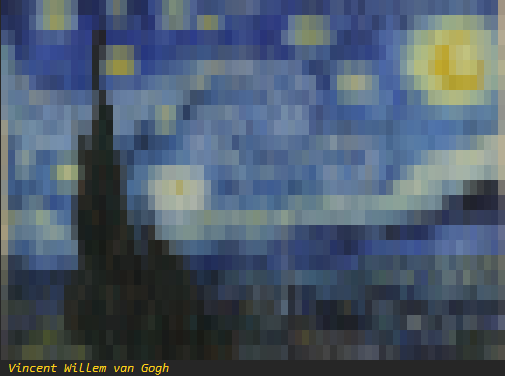

<p align="center"></p>
<p align="center">Sane, easy and flexible terminal string styling</p>

[](https://www.npmjs.com/package/tinta)
[](https://dev.azure.com/an-dz/tinta/_build/latest?definitionId=1&branchName=master)
[](https://codecov.io/gh/An-dz/tinta)
[](https://david-dm.org/an-dz/tinta)
[](https://david-dm.org/an-dz/tinta?type=dev)

# Tinta

> Noi per arte possiamo esser detti nipoti a Dio.
>
> _We, by our arts, may be called the grandsons of God._

– Leonardo Da Vinci

_Tinta_ is a JavaScript module that allows you to easily colourise
your terminal output using your coding style and without having to
memorise any syntax.

_Tinta_ is built on pure standard strict JavaScript/ECMAScript and
has zero dependencies and offers support for all possible SGR codes.

_Tinta_ comes from Latin _Tincta_ and is used on many Latin languages.
It can mean dyed, coloured, dye, ink or paint depending on the
language. Its pronunciation is like the word _tint_ but with an _ah_
at the end. (_tint_ also comes from _tincta_)

## Sane and easy

Using _Tinta_ is super easy, just import it with a name you'd like to
use and go on building the prototype chain indefinitely.

```js
const c = require("tinta");

c.red;
c.bold.red;
c.bold.italic.red;
```

Unlike other libraries _Tinta_ works with getters so you don't have
to keep adding those parenthesis all the time. It also has no need to
send commands to start or end "blocks", instead you just use common
ANSI escape code usage, that is, just call something that replaces
something you previously set and go on. The `reset` command will be
your best friend in many cases as it completely erases other codes.

The order of the properties defines the order the ANSI codes will be
added, for example:
```js
c.bold.black; // ESC[1;30m
c.black.bold; // ESC[30;1m
```

_Tinta_ does not care nor complains if you put things that conflict,
for example, if you add two foreground colours like `c.black.yellow`,
_Tinta_ will still print that as `ESC[30;33m`, such conflict will be
dealt by the terminal, the behaviour in this case according to the
standard is to set the colour _yellow_ as it was defined later. Keep
that in mind when using the `reset` command as `c.black.bold.reset`
will completely ignore _black_ and _bold_.

## Flexible

_Tinta_ tries to offer the maximum amount of options for any coding
style. All parameters are available in camelCase and snake_case and
many have aliases with different word ordering. For example, `red`,
`red_fg`, `fg_red`, `redFg` and `fgRed` are all possible names for
setting the text colour red. For a quick intro on how this works check
the [Quick Start](#quick_start) part.

But _Tinta_ is also flexible on the ways you can use it. _Tinta_ works
with any type of string manipulation. You don't have to use some
custom `console` command or weird function calls. These are all valid
uses and work:

```js
// template literals
console.log(`${c.white.blue_bg}This text is white on a blue background${c.reset}`);
// concatenation
console.log(c.white.blue_bg + "This text is white on a blue background" + c.reset);
// arguments list
console.log(c.white.blue_bg.m(), "This text is white on a blue background", c.reset.m());
// string substitution
console.log("%sThis text is white on a blue background%s", c.white.blue_bg.m(), c.reset.m());
```

Notice that the last two options ended with a call to a method called
`m()`, this is a convenience method alias of `toString()` and it's
required on the last two because `console` would instead try to print
their object representations instead of the strings with the escape
codes. The letter `m` was used because that's the letter used to end
the [ANSI escape codes][3] this module builds.

## Quick start

The base foreground colours can be set with any of the following:

`black`, `red`, `green`, `yellow`, `blue`, `magenta`, `cyan`, `white`

For the bright colours just add any of the following to their names:

- `bright_<colour>`
- `<colour>_bright`
- `bright<Colour>`
- `<colour>Bright`

And combining of the following are also valid (normal & bright):

- `fg_<colour>`
- `<colour>_fg`
- `fg<Colour>`
- `<colour>Fg`

Changing `fg` from the above to `bg` will set the background colour.

Bright black also has aliases `grey` and `gray`.

For setting RGB colours you can use the `fg()` and `bg()` methods. You
can pass any colour in RGB, HSL, Hex or an index for an 8-bit palette
as parameters, the method will to try recognise the format you sent.
But you can also use the direct methods if you prefer:

```js
// Hexadecimal RGB (Must start with #)
c.fg("#CDDC39");
c.hex("#CDDC39");
// 8bit palette (Must be between 0 and 255)
c.fg(142);
c.palette(142);
// RGB (Each argument must be between 0 and 255)
c.fg(205, 220, 57);
c.rgb(205, 220, 57);
// HSL (First argument must be between 0 and 360
//      the last two must be between 0 and 100 and end with %)
c.fg(66, "70%", "54%");
// no need for % if using the hsl method directly
c.hsl(66, 70, 54);
```

The above functions can do some limited type conversion, so passing a
number or a number as a string are both valid in some cases.

For the complete list of properties check the [list by categories][5]
and the [list by codes][6].

## Quick run

If you want to check and run some code using _Tinta_ the two files at
the root dir titled `welcome.js` and `sterrennacht.js` offer a quick
and nice glimpse on code using _Tinta_ in two different ways.

These files are not included when installing _Tinta_ as a dependency.

`welcome.js` will print a nice ASCII art of the _Tinta_ logo as the
following image shows:



`sterrennacht.js` is for those who have access to a terminal with RGB
support. Any Linux, Mac and Windows 10 have support for RGB, older
Windows versions will need to install a third party and might need to
use the `--colour always` command.

`sterrennacht.js` is the painting **The Starry Night** by Vincent van
Gogh drawn in 72 x 24 columns.



## Command line options

_Tinta_ automatically adds `--color` and `--colour` command line
options to you app. Available options are `always` to force it on,
`never` to force it off and `auto` that automatically enables colours
when outputting onto a tty. `auto` is the default.

You may use the `colour` commands with spaces or with an equal sign.
So `--colour auto` and `--colour=auto` are both valid. If you read
regexp this is the valid regular expression:

```regex
--colou?r( |=)(auto|always|never)
```

## Benchmark

_Tinta_ is also super fast. The below benchmark was taken on a 10 year
old computer with an [i3 380M][4] with 4GB RAM and Node v12.12 on
Windows 8.1 x64. The benchmark used was modified from colorette source.

Library     | Use Single Style        | Combine Styles          | Nested Usage
----------- | ----------------------- | ----------------------- | -----------------------
colorette   | 218,615 ±0.84% (87)     | 997,272 ±0.56% (89)     | 193,572 ±0.24% (90)
**tinta**   | **216,992 ±0.80% (87)** | **518,570 ±0.37% (84)** | **157,935 ±0.52% (90)**
kleur       | 204,654 ±0.75% (88)     | 568,945 ±0.79% (88)     | 147,241 ±0.40% (88)
ansi-colors | 67,161 ±0.62% (88)      | 167,653 ±0.43% (90)     | 90,265 ±1.02% (88)
colors      | 36,282 ±0.36% (86)      | 147,463 ±0.31% (90)     | 77,315 ±0.43% (89)
chalk       | 3,113 ±2.69% (79)       | 14,503 ±2.89% (75)      | 8,721 ±2.40% (76)

## Terminal support

Note that not all terminals have support for all the features. Make
sure to check if the support exists in the terminal you'll use.

The old Windows Command Prompt (cmd) for example only has support for
the main colours (normal and bright) and to reverse background and
foreground; bold just brightens the colour instead of making the font
bold and blinking text & custom colours just make the background
bright black. Everything else simply has no effect.

## Standards

Two standards govern the [ANSI escape sequences][3], [ECMA-048][1] is
the main document that standardises the majority of the escape
sequences, while [ISO-8613-6][2] extends it with support for custom
colours.


[1]: http://www.ecma-international.org/publications/standards/Ecma-048.htm
[2]: https://www.iso.org/standard/22943.html
[3]: https://en.wikipedia.org/wiki/ANSI_escape_code
[4]: https://ark.intel.com/content/www/us/en/ark/products/50178/intel-core-i3-380m-processor-3m-cache-2-53-ghz.html
[5]: https://github.com/An-dz/tinta/wiki/List-of-properties-by-category
[6]: https://github.com/An-dz/tinta/wiki/List-of-properties-by-code
